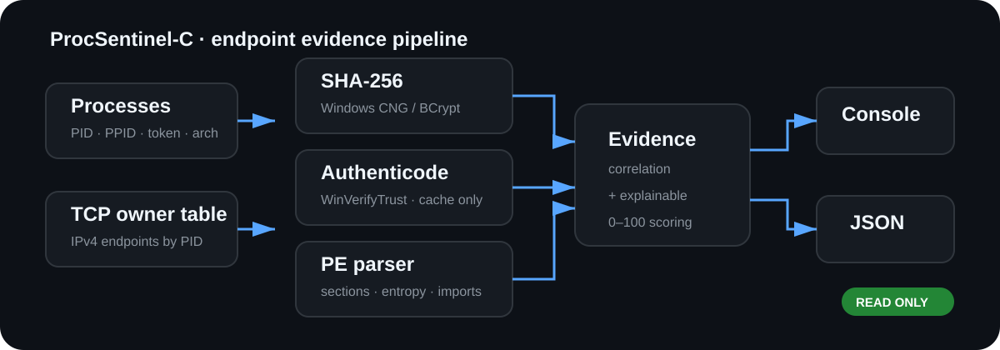
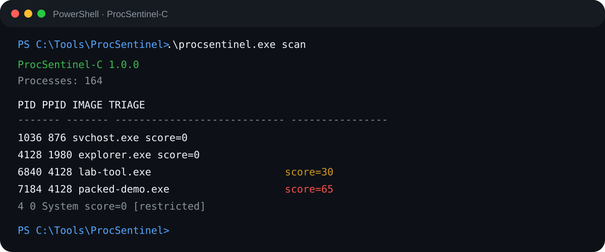
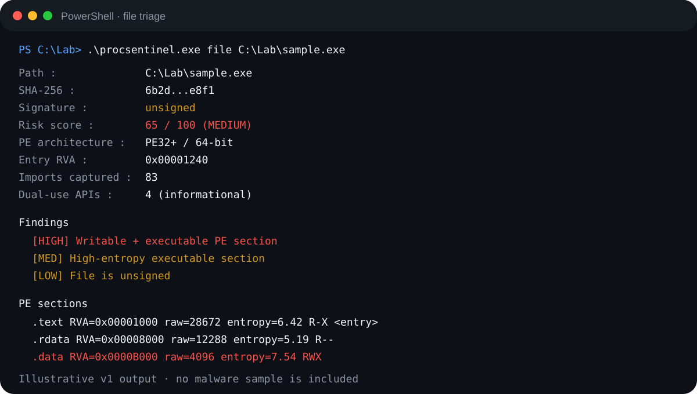
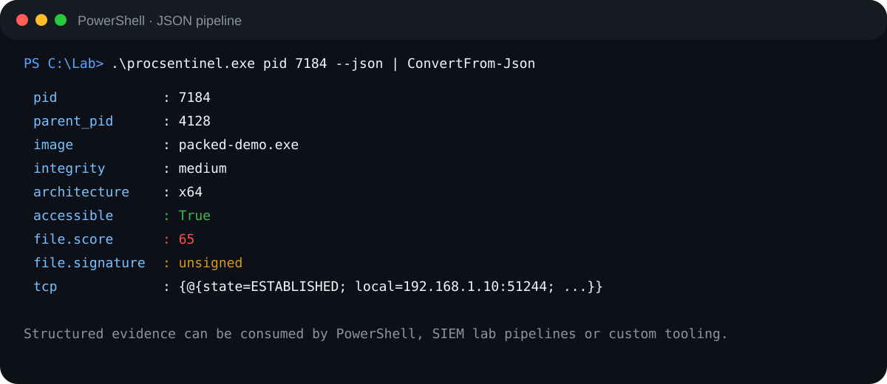

<div align="center">

# ProcSentinel-C

### Native Windows endpoint & PE triage in C11 / WinAPI

[](https://github.com/Michel-DV/ProcSentinel-C/actions/workflows/ci.yml)


**Process inventory · PE parsing · Authenticode · SHA-256 · TCP ownership · explainable risk scoring**

</div>

---

ProcSentinel-C is a small native **Windows endpoint triage utility** built from scratch in C. It correlates process metadata, executable trust, PE structure, cryptographic hashes and process-owned network state into a single analyst-oriented view.

The goal is not to label software as malware. The goal is to answer a more useful first-response question:

> **Which processes or PE files deserve an analyst's attention first, and why?**

ProcSentinel is deliberately **read-only**. It does not inject code, modify remote process memory, create remote threads, install persistence or attempt to bypass Windows security controls.

<p align="center">
  
</p>

## Terminal previews

### Endpoint scan

<p align="center">
  
</p>

### PE / file triage

<p align="center">
  
</p>

### Machine-readable output

<p align="center">
  
</p>

> The terminal images are **illustrative previews of the v1 output format**. Exact process names, hashes, paths and scores vary by host and file.

---

## Why this project exists

Windows incident triage often requires jumping between several utilities: Task Manager or Process Explorer for process context, PowerShell for hashes, signature tools for trust, PE viewers for section metadata and networking tools for active connections.

ProcSentinel-C demonstrates how those signals can be collected and correlated using native APIs while keeping the implementation small enough to study.

It is also intentionally different from the usual offensive Windows-internals demo. The same low-level knowledge can be used to build **endpoint visibility and detection tooling** rather than code-injection tooling.

## Highlights

| Area | Implementation |
| --- | --- |
| Language | C11 |
| Platform | Windows 10 / 11 |
| Process discovery | Toolhelp32 snapshot API |
| Process metadata | PID, PPID, image path, account, integrity, architecture |
| Hashing | SHA-256 via Windows CNG / `BCrypt` |
| Trust | Cache-only Authenticode verification via `WinVerifyTrust` |
| PE analysis | PE32 / PE32+ parser written in C |
| PE heuristics | W+X sections, executable entropy, writable entry point |
| Imports | Bounded import-table parsing with dual-use API context |
| Network | Process-owned IPv4 TCP state via `GetExtendedTcpTable` |
| Scoring | Deterministic 0-100 explainable triage score |
| Output | Human-readable console + JSON |
| Build | CMake + MSVC |
| Quality | Windows CI, CTest, CLI smoke tests |

## Quick start

### Requirements

- Windows 10 or Windows 11
- Visual Studio 2022 / Build Tools with the **Desktop development with C++** workload
- CMake 3.23+

```powershell
# Configure x64 Release build with tests
cmake -S . -B build -A x64 -DBUILD_TESTING=ON

# Compile
cmake --build build --config Release --parallel

# Run tests
ctest --test-dir build -C Release --output-on-failure
```

The binary will be located at:

```text
build\Release\procsentinel.exe
```

## CLI

```text
ProcSentinel-C 1.0.0 - Windows endpoint and PE triage

Usage:
  procsentinel.exe scan [--json] [--quick]
  procsentinel.exe pid <PID> [--json]
  procsentinel.exe file <PATH> [--json]
  procsentinel.exe --version
```

Typical analyst workflow:

```powershell
# 1. Fast inventory with minimal per-process work
.\procsentinel.exe scan --quick

# 2. Deep endpoint triage
.\procsentinel.exe scan

# 3. Drill into one interesting process
.\procsentinel.exe pid 4128

# 4. Inspect a PE directly from disk
.\procsentinel.exe file C:\Lab\sample.exe

# 5. Feed structured evidence into another workflow
.\procsentinel.exe file C:\Lab\sample.exe --json
.\procsentinel.exe pid 4128 --json
.\procsentinel.exe scan --json
```

## What ProcSentinel inspects

### 1. Process context

For processes that can be opened with `PROCESS_QUERY_LIMITED_INFORMATION`, ProcSentinel collects:

- PID and parent PID
- executable image name
- full image path
- account identity
- integrity level
- process/native architecture
- process-owned IPv4 TCP endpoints

Protected and restricted processes are expected on Windows. ProcSentinel **reports the restriction instead of trying to circumvent it**.

### 2. Cryptographic identity

The image on disk is hashed with SHA-256 through the Windows Cryptography API: Next Generation (`BCrypt`).

Hashes are useful for:

- case correlation
- allow/block-list pivots
- VirusTotal or internal threat-intelligence lookups performed separately by an analyst
- determining whether multiple processes share exactly the same executable

During a deep full-system scan, ProcSentinel caches file-analysis results by executable path so the same binary is not repeatedly re-hashed and re-parsed for every process instance.

### 3. Authenticode trust

`WinVerifyTrust` is used to classify the file as:

- `trusted`
- `unsigned`
- `invalid`
- `unknown`

Verification uses `WTD_CACHE_ONLY_URL_RETRIEVAL`. ProcSentinel therefore avoids silently reaching out to certificate infrastructure during endpoint triage. If Windows does not have enough cached information, the result can correctly remain `unknown`.

### 4. Native PE32 / PE32+ parsing

The parser is implemented directly in C rather than depending on a third-party PE library. It validates and extracts:

- DOS header / `MZ` signature
- NT / `PE\0\0` signature
- COFF machine type
- compile timestamp field
- PE32 vs PE32+
- entry-point RVA
- section table
- section characteristics
- section entropy
- import descriptors and named imports

Parsing is intentionally bounded. Captured sections/imports have hard limits, offsets are checked against the file buffer, and the parser refuses files above **512 MiB**.

### 5. Section heuristics

ProcSentinel raises explainable findings for layouts that commonly deserve review:

```text
Writable + executable section
High-entropy executable section
Entry point inside a writable section
```

None of these signals is a malware verdict. Packers, protectors, debuggers, EDRs, game anti-cheat software and other legitimate applications can produce unusual PE layouts.

### 6. Import context

Selected APIs associated with memory manipulation and cross-process tooling are counted as **informational dual-use imports**, for example:

```text
VirtualAllocEx
WriteProcessMemory
CreateRemoteThread
ReadProcessMemory
OpenProcess
SetThreadContext
QueueUserAPC
```

They deliberately do **not** add points to the v1 score. Legitimate security, debugging and administration software may use exactly the same APIs.

### 7. Process-owned network state

ProcSentinel queries the Windows TCP owner table once during a deep endpoint scan and associates IPv4 TCP entries with their owning PID.

For single-PID inspection, the output can include entries such as:

```text
TCP/IPv4
  LISTEN       0.0.0.0:8080 -> 0.0.0.0:0
  ESTABLISHED  192.168.1.10:51244 -> 203.0.113.20:443
```

Network state is presented as **context**, not as automatic evidence of compromise.

## Explainable triage scoring

ProcSentinel uses a deliberately small scoring model so an analyst can understand exactly why a score changed.

| Signal | Points | Why it matters |
| --- | ---: | --- |
| Unsigned executable | +10 | Weak trust signal; common in legitimate software |
| Invalid/untrusted signature | +20 | Stronger trust anomaly |
| Signature state unknown | +5 | Low-confidence uncertainty |
| Writable + executable section | +35 | High-value PE permission anomaly |
| High-entropy executable section | +20 | Possible packing/compression |
| Entry point in writable section | +25 | Unusual executable layout |

Risk bands:

```text
  0 - 14   INFO
 15 - 39   LOW
 40 - 69   MEDIUM
 70 - 100  HIGH
```

The score is capped at `100` and is strictly a **review-prioritization signal**.

See [`docs/SCORING.md`](docs/SCORING.md) for the scoring contract and false-positive considerations.

## Example deep file analysis

```text
Path              : C:\Lab\sample.exe
SHA-256           : 6b2d...e8f1
Signature         : unsigned
Risk score        : 65 / 100 (MEDIUM)
PE architecture   : PE32+ / 64-bit
Machine           : 0x8664
Entry RVA         : 0x00001240
Sections          : 6
Imports captured  : 83
Dual-use APIs     : 4 (informational)

Findings
  [HIGH] Writable + executable PE section
  [MED]  High-entropy executable section
  [LOW]  File is unsigned

PE sections
  .text    RVA=0x00001000 raw=28672    entropy=6.42 R-X  <entry>
  .rdata   RVA=0x00008000 raw=12288    entropy=5.19 R--
  .data    RVA=0x0000B000 raw=4096     entropy=7.54 RWX
```

The sample values above are illustrative; ProcSentinel does not ship a malware sample.

## JSON output

Structured output is designed for pipelines and lab automation. Example shape:

```json
{
  "path": "C:\\Lab\\sample.exe",
  "sha256": "...",
  "signature": "unsigned",
  "score": 65,
  "pe": {
    "valid": true,
    "is_64bit": true,
    "machine": 34404,
    "entry_rva": 4672,
    "sections": [],
    "findings": {
      "wx_section": true,
      "high_entropy_exec": true,
      "entrypoint_writable": false,
      "dual_use_api_count": 4
    }
  }
}
```

Schema notes and stability expectations are documented in [`docs/OUTPUT.md`](docs/OUTPUT.md).

## Architecture

```text
                      Windows endpoint
                            │
          ┌─────────────────┼─────────────────┐
          │                 │                 │
   Process snapshot     TCP owner table    PE file path
          │                 │                 │
          ├──── token / architecture          ├──── SHA-256
          │                                   ├──── Authenticode
          │                                   └──── PE parser
          │                                          │
          └──────────────────┬───────────────────────┘
                             │
                       Evidence model
                             │
                     Explainable scoring
                             │
                  ┌──────────┴──────────┐
                  │                     │
              Console view          JSON output
```

Detailed module responsibilities and design decisions: [`docs/ARCHITECTURE.md`](docs/ARCHITECTURE.md).

## Repository structure

```text
ProcSentinel-C/
├── include/
│   └── procsentinel/
│       └── procsentinel.h
├── src/
│   ├── main.c          # CLI / command dispatch
│   ├── process.c       # process + token metadata
│   ├── network.c       # process-owned IPv4 TCP state
│   ├── pe.c            # PE32 / PE32+ parser
│   ├── sha256.c        # BCrypt SHA-256
│   ├── signature.c     # WinVerifyTrust / Authenticode
│   ├── scoring.c       # deterministic score
│   ├── report.c        # text + JSON renderers
│   └── util.c          # encoding / JSON helpers
├── tests/
│   └── test_core.c
├── docs/
│   ├── ARCHITECTURE.md
│   ├── OUTPUT.md
│   ├── SCORING.md
│   ├── THREAT_MODEL.md
│   └── assets/
├── .github/workflows/
│   └── ci.yml
├── CMakeLists.txt
├── CONTRIBUTING.md
├── SECURITY.md
├── CHANGELOG.md
└── LICENSE
```

## Testing & CI

The test executable currently validates:

- entropy edge cases
- score composition and score capping
- PE parsing against the compiled test executable itself
- SHA-256 generation
- rejection of a synthetic non-PE file
- status-name helpers

GitHub Actions runs on `windows-latest` with MSVC and performs:

```text
CMake configure
       ↓
Release build
       ↓
CTest
       ↓
CLI version smoke test
       ↓
Self-analysis JSON smoke test
       ↓
Quick endpoint inventory smoke test
```

The workflow has `contents: read` permissions only.

## Security boundary

ProcSentinel is an endpoint **observation** tool. It intentionally excludes functionality that would turn it into an offensive process-manipulation framework.

It does **not** implement:

- process injection
- `WriteProcessMemory` against remote processes
- remote thread creation
- shellcode execution
- credential dumping
- persistence
- exploit delivery
- arbitrary remote command execution
- security-control evasion or bypass

See [`SECURITY.md`](SECURITY.md) and [`docs/THREAT_MODEL.md`](docs/THREAT_MODEL.md).

## Design principles

1. **Read-only first** — collect evidence without changing endpoint state beyond ordinary file/API reads.
2. **Explain findings** — avoid opaque "malicious / clean" labels.
3. **Bound untrusted input** — PE parsing has explicit size, count and offset constraints.
4. **Prefer uncertainty to fake certainty** — inaccessible processes and unknown signature state remain explicit.
5. **Keep dependencies small** — runtime functionality is built on Windows APIs and the C runtime.
6. **Machine-readable by default** — important analyst evidence can be exported as JSON.

## Current limitations

The v1 release intentionally has a narrow scope:

- IPv4 TCP only; no IPv6 ownership yet
- no live ETW/event-stream monitoring
- no remote-memory inspection
- no kernel driver
- no cloud reputation lookup
- no YARA engine embedded
- Authenticode is trust-state only; signer-chain metadata is not yet exported
- score weights are heuristic and require analyst validation in each environment

These are documented limitations, not hidden capabilities.

## Roadmap

Potential defensive extensions:

- IPv6 TCP ownership
- signer / certificate metadata
- baseline comparison between scans
- stable JSON schema version field
- ETW ingestion for process and image-load events
- additional malformed-PE regression corpus
- fuzzing harness for parser components
- optional CSV export

The project will preserve its **read-only endpoint-security boundary**.

## Documentation

- [`Architecture`](docs/ARCHITECTURE.md) — modules, data flow and engineering decisions
- [`Scoring`](docs/SCORING.md) — score contract and false positives
- [`Output`](docs/OUTPUT.md) — JSON fields and CLI output expectations
- [`Threat model`](docs/THREAT_MODEL.md) — trust boundaries and non-goals
- [`Security policy`](SECURITY.md) — vulnerability reporting and project scope
- [`Changelog`](CHANGELOG.md) — version history

## Responsible use

Use ProcSentinel only on systems you own or are authorized to assess. The tool is designed for endpoint security research, incident-response labs, defensive engineering and education.

## License

MIT — see [`LICENSE`](LICENSE).
